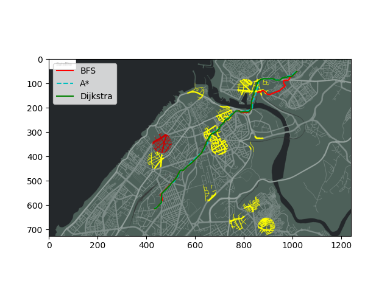
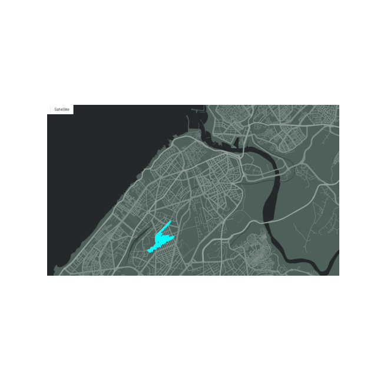
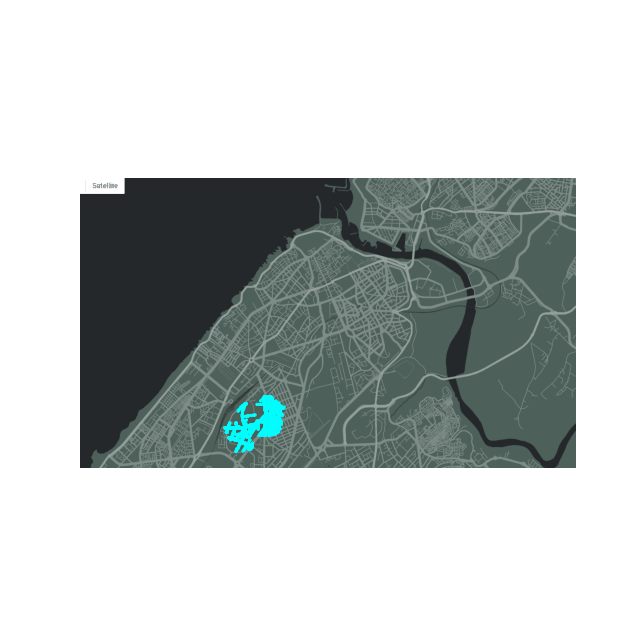

# 🗺️ TIPE 2024: Optimisation d'un trajet à l'aide d'algorithmes



### 📊 Exploration Animations
| A* (A-Star) Exploration | Dijkstra Exploration |
|:---:|:---:|
|  |  |

## 📌 Project Overview
This project was developed for my **TIPE 2024** (Travail d'Initiative Personnelle Encadré). It is a Python-based visualization and comparison tool for graph pathfinding algorithms. 

The goal of this project is to parse a real-world satellite map (Rabat-Salé, Morocco), construct a walkable graph, and compute the optimal routes between a starting point (e.g., EMI) and a destination using three distinct pathfinding algorithms:
- **Breadth-First Search (BFS)**
- **Dijkstra's Algorithm** (Optimized with Priority Queues)
- **A* (A-Star) Algorithm** (Optimized with Euclidean Heuristics)

## 🚀 Features
- **Dynamic Image Parsing:** Automatically converts a satellite map (`map_source.png`) into a highly dense binary matrix and then into a traversable graph.
- **Dynamic Obstacles:** Places static roadblocks (fixed circles) and dynamically generates random traffic jams across the grid.
- **Algorithmic Comparison:** Runs and plots all three algorithms sequentially, comparing their computational time, path cost, and exploration strategy.
- **Highly Optimized Engine:** Uses `heapq` structures for Dijkstra and A*, allowing computation over tens of thousands of nodes in a fraction of a second.

## 🛠️ How it Works
The map consists of pixels representing traversable roads and untraversable structures (buildings, water, etc.).
1. The script first places custom obstacles over the map (changing pixel colors).
2. It loops through the pixels and connects adjacent road pixels to form a `Graph` of `Node` objects.
3. The algorithms explore this network:
   - **BFS (Red):** Explores equally in all directions. Finds a sub-optimal path since it does not account for diagonal distance weights.
   - **Dijkstra (Green):** Explores all directions but respects Euclidean distance weights between nodes, guaranteeing the mathematical shortest path.
   - **A* (Cyan):** Uses a heuristic to bias exploration directly toward the target, guaranteeing the mathematical shortest path while exploring significantly fewer nodes than Dijkstra.

## ⏱️ Algorithm Complexity & Benchmarks
Here is a breakdown of the time complexity for each algorithm, alongside real-world execution times measured on the Rabat-Salé map:

| Algorithm | Time Complexity | Real Execution Time |
|-----------|----------------|---------------------|
| **BFS** | O(V + E) | ~0.7 seconds |
| **Dijkstra** | O((V + E) log V) | ~2.3 seconds |
| **A\*** | O((V + E) log V) *with heuristic bias* | ~1.5 seconds |

## ⚙️ Installation & Usage

### 1. Requirements
**Python 3.10+** is highly recommended. Ensure you have Python installed, then install the required dependencies (primarily OpenCV, NumPy, and Matplotlib).
```bash
pip install -r requirements.txt
```

### 2. Run the Pathfinding Simulator
```bash
python main.py
```
This will generate the obstacles, build the graph, compute the 3 paths, print execution times to the terminal, and save the final result to `result_comparison.png`. It will also generate the exploration GIFs automatically!

## 🎓 Academic Context
This repository contains the core codebase for the TIPE presentation. The included PDF (`Optimisation d'un trajet à l'aide d'algorithmes.pdf`) provides the formal academic breakdown, mathematical proofs, and analytical conclusions drawn from this simulation.
